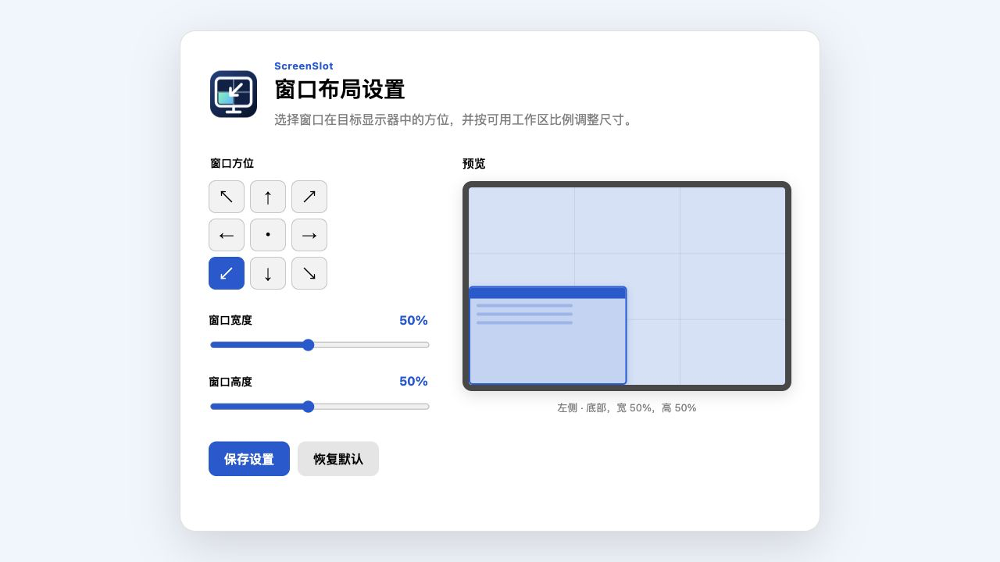

# ScreenSlot

[English](README.md)

ScreenSlot 是一个 Chrome 扩展：它会把当前活动标签页从原窗口分离出来，创建一个新窗口，并将其放到外接显示器的自定义区域。

## 功能特点

- 只移动当前 Chrome 标签页，不管理其他应用程序窗口。
- 使用显示器的可用工作区，自动避开菜单栏、Dock 或任务栏。
- 支持一个或多个外接显示器。
- 提供九种窗口方位，并可分别调整窗口宽度和高度。
- 显示器布局不变时，会记住已选择的目标显示器。
- 自动跟随 Chrome 界面语言，内置英文和简体中文。
- 完全在本地运行，不读取、截取或上传屏幕内容。

## 环境要求

- Chrome 111 或更高版本
- 至少连接两块显示器

## 从源码安装

1. 克隆或下载本仓库。
2. 在 Chrome 地址栏打开 `chrome://extensions/`。
3. 打开右上角的“开发者模式”。
4. 点击“加载已解压的扩展程序”，然后选择本仓库目录。
5. 可选：在扩展菜单中将 ScreenSlot 固定到工具栏。

默认布局是目标显示器的左下四分之一。

## 窗口布局设置



可以通过以下任一方式打开设置页：

- 右键点击 ScreenSlot 工具栏图标，然后选择“选项”。
- 当 ScreenSlot 弹窗或首次授权页保持打开时，点击“窗口布局设置”。
- 在 `chrome://extensions/` 中打开 ScreenSlot 详情，然后选择“扩展程序选项”。

设置页支持：

- 从左上、顶部居中、右上、左侧居中、屏幕居中、右侧居中、左下、底部居中、右下九种方位中选择。
- 分别将窗口宽度和高度调整为目标显示器可用工作区的 10%–100%。
- 保存前实时预览窗口位置和尺寸。
- 恢复默认的左下、50% × 50% 布局。

设置保存在 Chrome 本地存储中，并在下次移动标签页时生效。

## 使用方法

1. 切换到需要移动的标签页。
2. 点击 ScreenSlot 扩展图标。
3. 首次使用时，ScreenSlot 会打开独立设置页。点击“允许并发送标签页”，然后允许 Chrome 的窗口管理权限请求。
4. 如果有多个可用目标显示器，选择一个显示器后再次点击发送按钮。

工具栏弹窗不是可靠的浏览器权限提示宿主，因此首次授权需要在独立页面完成。授权成功后：

- 只有一个外接显示器时，点击扩展图标会立即移动当前标签页并关闭弹窗。
- 有多个外接显示器时，ScreenSlot 会记住首次选择的目标；只有显示器布局或分辨率变化后才会要求重新选择。

如果当前 Chrome 窗口只有一个标签页，移动该标签页后原窗口也会关闭。这是 Chrome 的正常行为。

## 行为边界

- 用户拒绝窗口管理权限或只连接一块显示器时，不会移动标签页。
- Chrome 或操作系统窗口管理器可能对最终窗口尺寸或位置做少量修正。
- 标签页分离和窗口定位由扩展后台 Service Worker 执行，因此移动原窗口唯一的标签页也不会中断操作。

## 开发与验证

ScreenSlot 使用原生 HTML、CSS 和 JavaScript，没有构建步骤或运行时依赖。

使用 Node.js 运行全部单元测试、语法、Manifest、资源和国际化检查：

```sh
npm run check
```

生成只包含运行文件的 Chrome Web Store ZIP：

```sh
npm run package
```

发布包生成在 `dist/`。如需验证完整扩展流程，请在 `chrome://extensions/` 中重新加载扩展，并按照[多显示器测试清单](tests/manual/multi-display.md)检查。

如需在不安装扩展的情况下只检查布局，可以通过 HTTP 启动本仓库，并打开 `tests/fixtures/options-preview.html?locale=en`；将参数改成 `locale=zh_CN` 可预览中文。

## 项目结构

```text
manifest.json   扩展入口与权限声明
_locales/       英文与简体中文语言资源
background/     Service Worker 与可测试窗口管理逻辑
popup/          工具栏弹窗
setup/          首次授权流程
options/        窗口布局设置与预览
shared/         布局、显示器、偏好、消息和国际化模块
tests/unit/     Node.js 单元测试
tests/manual/   多显示器回归测试清单
tests/fixtures/ 使用真实语言资源的浏览器预览夹具
scripts/        校验与发布打包脚本
icons/          扩展图标及 SVG 源文件
docs/images/    文档使用的选项页截图
```

GitHub Actions 会在每次推送和拉取请求时执行 `npm run check`，并验证扩展发布包。

## 开源许可

ScreenSlot 使用 [MIT License](LICENSE) 发布。
